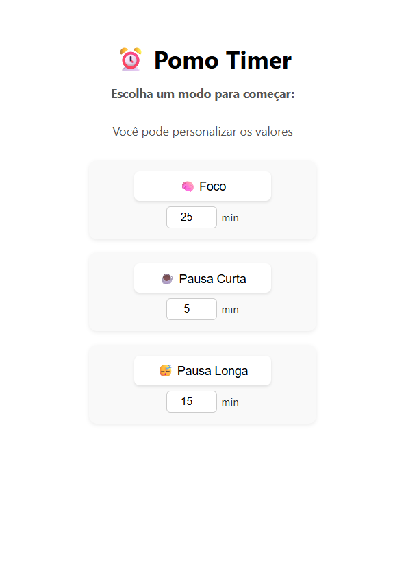

# ⏰ Pomo Timer

Um app de Pomodoro simples, bonito e responsivo para te ajudar a manter o foco e organizar seus ciclos de trabalho e descanso.

---

## 📸 Tela inicial



---

## 🚀 Acesse online

🔗 [Clique aqui para testar](https://wellldev.github.io/pomodoro-timer/)

---

## ⚙️ Funcionalidades

- ✅ Ciclos automáticos: Foco → Pausa Curta → Foco → Pausa Longa
- 🔔 Notificações no navegador ao fim de cada sessão
- ⏱ Ajuste manual dos tempos diretamente na interface
- 📱 Totalmente responsivo (mobile e desktop)
- 💡 Interface intuitiva e minimalista

---

## 🛠 Tecnologias usadas

- HTML5
- CSS3
- JavaScript (Vanilla JS)

---

## 📂 Como rodar localmente

```bash
git clone https://github.com/wellldev/pomodoro-timer.git
cd pomodoro-timer
# abra o arquivo index.html no navegador

